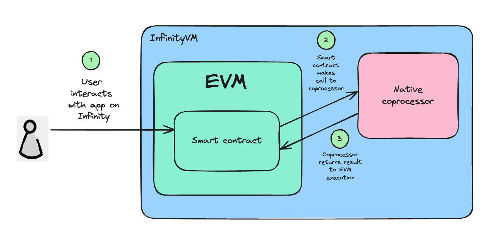
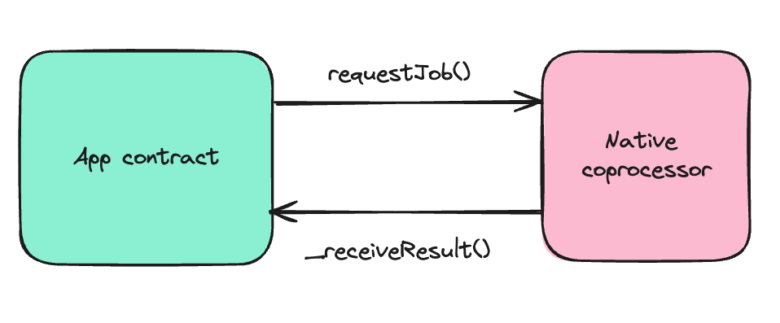
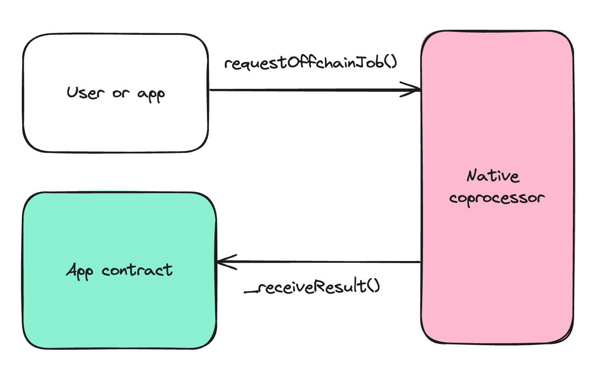

# InfinityVM Foundry Template

This repository implements an example application using InfinityVM. InfinityVM enables developers to use expressive offchain compute to build and enhance their EVM applications.

## Overview

This repo contains three folders:
1. `programs`: Rust programs that contain application logic to be run offchain in the coprocessor.
2. `contracts`: A `SquareRootConsumer` contract for the application, contracts for the coprocessor, and tests and a deploy script for the contracts.
    - To build on InfinityVM, you just need to read the `SquareRootConsumer.sol` and `SquareRootConsumer.t.sol` files. The coprocessor contracts in `contracts/coprocessor` expose an interface you can use but you don't need to read how they're implemented.
3. `zkvm-utils`: Utility functions for InfinityVM. *You don't need to read these files to build on InfinityVM.*

The flow of the InfinityVM coprocessor looks like this:
1. An app contract or an offchain user requests a compute job from the coprocessor.
2. The coprocessor executes this job and submits the result back to the contract.
3. The app contract can simply use the result from the coprocessor in any of their app logic.



## Quick Start

This section will take us through an example of building an app that computes and stores the square root of numbers.

Clone this repo (including submodules):

```
git clone --recursive https://github.com/InfinityVM/infinityVM-foundry-template.git
```

Setup rust

```sh
curl --proto '=https' --tlsv1.2 -sSf https://sh.rustup.rs | sh
rustup use 1.80
```

Next, install the risc0 toolchain for zkVM functionality:

```sh
cargo install cargo-binstall
cargo binstall cargo-risczero
cargo risczero install
cargo risczero --version
```

### Write a Rust program to run in the coprocessor

All application programs run by the coprocessor live in `programs/app/src`. For our square root application, we have a `square_root.rs` program which takes in an integer and returns the square root. This program is also a good example of how to accept inputs and return output.

This is a simple example but you could write a lot more interesting and complex code in your Rust programs. One thing to note is you can't print anything to `stdout` in your Rust program (if you'd like to print something while debugging your Rust program, we've provided instructions in the `Write tests for your app` section below).

After you've written your Rust program, add it to `programs/app/Cargo.toml`. For example, if we wrote a new program `multiply.rs`, we would add it like this:
```
[package]
name = "guests"
version = "0.1.0"
edition = "2021"

[[bin]]
name = "square-root"
path = "src/square_root.rs"

[[bin]]
name = "multiply"
path = "src/multiply.rs"
```

Now you can run:
```
cargo build
```
This will build your program and update the relevant contracts to allow you to use your program from the contracts. Every program has a unique program ID generated for it, which is added to the `ProgramID.sol` contract.

### Use the program in your app contract

We have a contract for the square root app in `contracts/src/SquareRootConsumer.sol`. 

#### Making calls to the coprocessor from a contract

We can call the `square_root.rs` program from our app contract. We just need to do two things:

1. Call `requestJob()` with the program ID of `square_root.rs` from `ProgramID.sol` along with ABI-encoded inputs (the number we want to calculate the square root of).
2. Write a `_receiveResult()` function which accepts the output from the `square_root.rs` program and uses it in some application logic.



To build the contracts, you can run:
```
forge build
```

#### Making calls to the coprocessor offchain

We can also call the `square_root.rs` program offchain by sending a request directly to the coprocessor. The coprocessor will execute the job and submit the result to our app contract. The flow looks like this:



The offchain request to the coprocessor can be sent by an app, a user, or any authorized third-party. To support offchain requests for your app contract, you need to implement the `isValidSignature()` function in your contract, which is called to verify whether an offchain request is signed by an authorized signer/user. We've provided an example implementation of `isValidSignature()` in the `SquareRootConsumer.sol` contract (which checks that each job request is signed by a signer owned by the app), but you can implement any logic or checks you'd like.

To test this flow, you can call `requestOffchainJob()` in the tests. More instructions on how to write tests are in the `Write tests for your app` section below.

### Write tests for your app

We have two end-to-end tests for the `SquareRootConsumer` app in `SquareRootConsumer.t.sol`:

1. `test_Consumer_RequestJob()`: This test requests the square root of a number from the `SquareRootConsumer.sol` contract. It verifies that the contract calls the `square_root.rs` program and that the coprocessor submits the correct result back to the contract.
2. `test_Consumer_RequestOffchainJob()`: This test sends an offchain request for the square root of a number directly to the coprocessor, using `requestOffchainJob()`. It verifies that the coprocessor submits the correct result back to the `SquareRootConsumer.sol` contract.

You can add any tests for your app contracts in the `SquareRootConsumer.t.sol` file.

To run the tests, you can run:
```
forge test -vvv --ffi 
```

If you would like to test or debug your Rust program by itself, we have an example test in `programs/src/lib.rs`. You can run this using:
```
cargo test
```
You can add `println!` statements to your Rust program to help while debugging.

Feel free to reach out to our team if you have any questions, we're happy to help!

### Note: Nonces

Each job request for an app contract must have a unique `nonce` submitted with it, to prevent replay attacks. The `Consumer.sol` contract contains a `getNextNonce()` function to return the next nonce to be used by job requests from the contracts and offchain users, and an `updateLatestNonce()` function to update the latest nonce value once a job has been submitted. 

We have provided a default implementation for `getNextNonce()` and `updateLatestNonce()` in `Consumer.sol` to implement a simple nonce which increases by 1 every time a job is requested. This should be good enough for most apps, but you can override it in your consumer contract if you'd like. For example, you could use the unix timestamp in milliseconds as the nonce for offchain calls to the coprocessor.

### Note: App servers

With InfinityVM, some apps can leverage offchain job requests to run as real-time servers. Because of the limitations of foundry, you can't build and test an app server using the foundry template. Instead, you would need to write tests for your app server similar to how you would write end-to-end tests for any multi service setup. We have example end-to-end tests for app servers in the InfinityVM repo.

### Development

Lint:

```sh
RISC0_SKIP_BUILD=true cargo clippy
```

Format:

```sh
cargo +nightly fmt
```