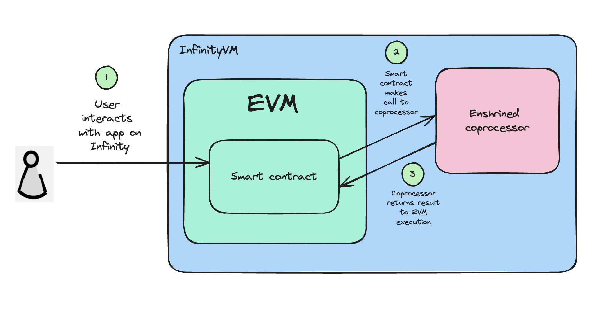

# InfinityVM Foundry Template

This repository implements an example application using InfinityVM. InfinityVM enables developers to use expressive offchain compute to build and enhance their EVM applications.

## Overview

This repo contains three folders:
1. `programs`: Rust programs that contain application logic to be run offchain in the coprocessor.
2. `contracts`: An `SquareRootConsumer` contract for the application, shared contracts for the coprocessor, and tests and a deploy script for the contracts.
    - To make it easier for developing on InfinityVM, you just need to care about the `SquareRootConsumer.sol` and and `SquareRootConsumer.t.sol` files. The shared contracts expose an interface you can use but you don't need to worry about how they are implemented.
3. `zkvm-utils`: Utility functions for InfinityVM. *You don't need to worry about these files.*

The flow of the InfinityVM coprocessor looks like this:
1. An app contract requests a compute job from the coprocessor.
2. The coprocessor picks up this job and submits the result back to the contract.
3. The app contract can simply use the result from the coprocessor in any of their app logic.



## Quick Start

This section will take us through an example of building an app that computes and stores the square root of numbers.

First, clone this repo (including submodules):
```
git clone --recursive https://github.com/risc0/risc0-foundry-template.git
```

### Write a Rust program to run in the coprocessor

All application programs run by the coprocessor live in `programs/guest/src`. For our square root application, we have a `square-root.rs` program which takes in an integer and returns the square root. This program is also a good example of how to accept inputs and return output.

This is a simple example but you could write a lot more interesting and complex code in your Rust programs.

After you've written your Rust program, run:
```
cargo build
```
This will build your program and update the relevant contracts to allow you to use your program from the contracts. Every program has a unique program ID generated for it, which is added to the `ProgramID.sol` contract.

### Use the program from your app contract

We have a contract for the square root app in `SquareRootConsumer.sol`. To use the `square-root.rs` program, we just need to do two things:

1. Call `requestJob()` with the program ID of `square-root.rs` from `ProgramID.sol` along with ABI-encoded inputs (the number we want to calculate the square root of).
2. Write a `_receiveResult()` function which accepts the output from the `square-root.rs` program and uses it in some application logic.

To build the contracts, you can run:
```
forge build
```

### Write tests for your application

We have a test for the `SquareRootConsumer` app in `SquareRootConsumer.t.sol`. This test requests the square root of a number and verifies that the contract calls the `square-root.rs` program and stores the correct result from the coprocessor. You can add any tests for your app contracts in this file.

To run the tests, you can run:
```
forge test -vvv --ffi 
```

Feel free to reach out to our team if you have any questions, we're happy to help!
